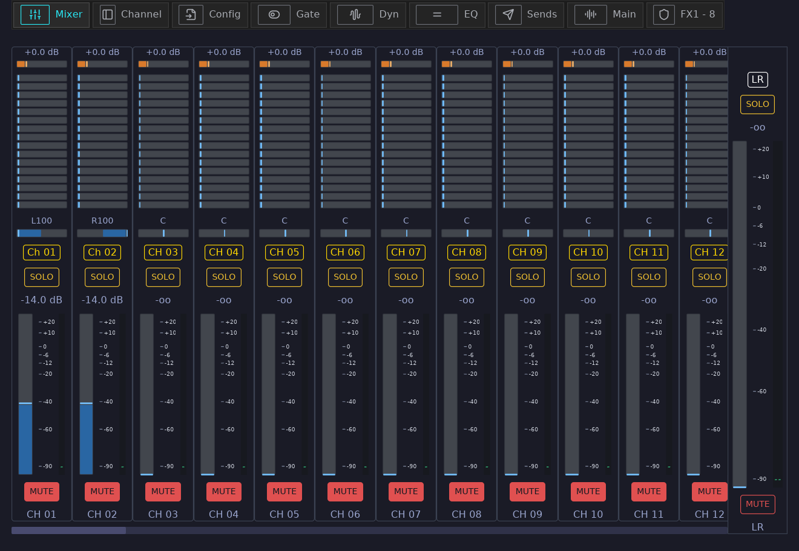

# mixosc

Rust OSC client for Behringer X32-family mixers.



`mixosc` currently contains two pieces:

- A desktop GUI built with `iced` that discovers an X32 on the local network and exposes a mixer-style control surface.
- A Rust library for X32 UDP/OSC discovery, connection probing, state loading, state updates, meter parsing, and reference-file loading.

## Current GUI behavior

The application is no longer just a connection monitor. When a mixer is reachable, it loads and displays:

- `CH 01-32`
- `AUX 01-08`
- `BUS 01-12`
- `FX 01-08`
- `MTX 01-06`
- `DCA 1-8`
- `Main LR`

For the strips that support them, the UI shows and updates in real time:

- Name and scribble-strip color
- Input gain or trim
- Sends
- Pan
- Fader level
- Input and main/matrix meters
- Mute
- Solo

The app subscribes to live OSC updates with `/xremote` and meter subscriptions, so local changes on the mixer are reflected back into the UI.

## What is implemented per strip type

- Channels and aux inputs: gain/trim, sends to buses 1-16, pan, fader, mute, solo, color, name, meters
- FX returns: sends to buses 1-16, pan, fader, mute, solo, color, name
- Buses: sends to matrices 1-6, pan, fader, mute, solo, color, name
- Matrices: fader, mute, color, name, matrix meter
- DCAs: fader, mute, color, name
- Main LR: fader, mute, color, stereo meter

Implementation details from the current code:

- Gain uses headamp control where available and trim otherwise.
- Channel `17-32` use trim gain; earlier channels and supported aux inputs can use headamp gain.
- Gain is not exposed for buses, FX returns, matrices, or DCAs.
- Pan is not exposed for matrices or DCAs.
- DCA and matrix solo are not sent to the mixer.
- Master solo is only a local UI toggle right now; it is not sent to the mixer.
- Passing an invalid CLI argument causes a panic because the first positional argument is always parsed as `host[:port]`.

## Running

Automatic discovery on the local network:

```bash
cargo run
```

Connect to a specific mixer:

```bash
cargo run -- 192.168.1.62
```

You can also include a custom port:

```bash
cargo run -- 192.168.1.62:10023
```

Or use the environment variable:

```bash
MIXOSC_MIXER_ADDR=192.168.1.62 cargo run
```

The default X32 port is `10023`.

## Library surface

The crate exports OSC/X32 helpers from `src/x32.rs`, including:

- Discovery and connectivity: `DiscoveryProbe`, `ConnectionProbe`, `DiscoveredMixer`, `ProbeOutcome`
- Strip state loading and control: `FaderBankProbe`, `PanBankProbe`, `GainBankProbe`, `SendBankProbe`, `MuteBankProbe`, `SoloBankProbe`, `NameBankProbe`, `ColorBankProbe`
- Meter handling: `batchsubscribe_meter_request`, `renew_request`, `parse_input_meter_packet`, `parse_main_meter_packet`
- Console update parsing: `parse_console_update`, `ConsoleUpdate`
- Address parsing and constants: `parse_target`, `X32_DEFAULT_PORT`, `X32_BROADCAST_ADDR`, `XREMOTE_REQUEST`

It also exports `ReferenceFiles` and related types from `src/reference.rs` for loading JSON reference data:

- `x32_osc_endpoints.json`
- `x32_osc_full_extract.json`

Those reference loaders are part of the library API, but the current GUI does not use them directly.

## Development

Build check:

```bash
cargo check
```

This repository currently has a single binary entry point in `src/main.rs` and a reusable library in `src/lib.rs`.
